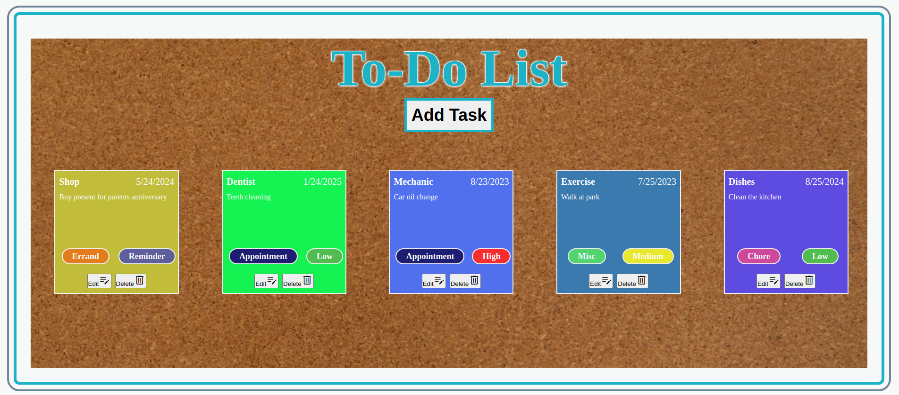

# To-Do-List

**Objective**

I created a To-Do List using JavaScript, HTML, CSS, Webpack, JSON, and local storage. The To-Do List will save tasks for the user with the options listed below:

***Features***
1. The "Add Task" button opens a form where users can input their task information. Task information included in the form:
   
   a. Task Name
   
   b. Date
   
   c. Task Desription
   
   d. Category Selection Menu: Chore, Errand, Appointment, or Misc (each selection has a chip color to match it for easy reference)
   
   e. Priority Selection Menu: Low, Medium, High, Reminder (each selection has a chip color to match it for easy reference)
   

3. Each taskcard is dynamically created with the users entries. In addition to the above form features shown on each card the user will also see an Edit and Delete button to manipulate their card entries.

***Credits***
1. Moment.js (https://momentjs.com/) library for date styling

2. Material Symbols and Icons (https://fonts.google.com/icons) library for the edit and delete button icons

3. Pexels (https://pixabay.com/photos/background-cork-board-blank-72250/) for the background cork board image.
